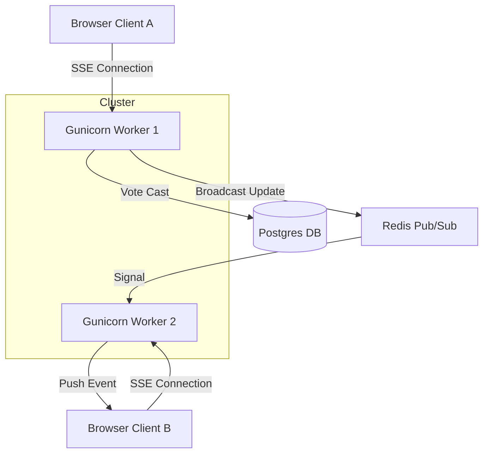

# Oponn Voting Service

Oponn is a high-performance, real-time voting service built with **FastAPI**, **HTMX**, and **Server-Sent Events (SSE)**. It follows the **Server-Informed UI (SIUI)** pattern, providing a terminal-inspired "Deep Charcoal" and "Gemini Purple" aesthetic.

## Architecture

Oponn is designed for horizontal scalability across multiple worker processes. It uses **Redis Pub/Sub** to synchronize live results and **Postgres** for persistent storage.



### Key Components
- **FastAPI**: Handles the ASGI web requests and SSE streaming.
- **HTMX**: Powers dynamic DOM updates without complex client-side frameworks.
- **Redis**: Manages distributed locking and real-time event broadcasting.
- **Postgres**: Ensures durable persistence of ballots and vote counts.
- **Lifespan Reaper**: A background task that prunes stale in-memory metadata to prevent leaks.

## Getting Started

### Prerequisites
- Python 3.12+
- [Poetry](https://python-poetry.org/)
- Docker Desktop (for Postgres/Redis)

### 1. Installation
```bash
# Install dependencies
poetry install
```

### 2. Infrastructure
```bash
# Start Postgres 16 and Redis 7
make services-up

# Apply database migrations
make upgrade
```

### 3. Running the Application

#### Development Mode (Single Worker, Hot-Reload)
Best for UI/Logic development.
```bash
make dev
```

#### Production Simulation (Multiple Workers)
Best for testing distributed behavior and SSE synchronization.
```bash
make prod
```

## Development Commands

| Command | Description |
|---------|-------------|
| `make test` | Run the full test suite (In-Memory) |
| `make test-sql` | Run tests against a Postgres container |
| `make format-ui` | Reformat all HTML/CSS/JS files |
| `make lint` | Run Python linting (Ruff) |
| `make typecheck` | Run strict type checking (Basedpyright) |

---
*Built with simplicity and horizontal scale in mind.*